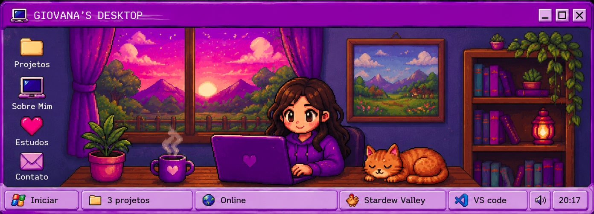

 

## sobre_mim.exe

**Olá, eu sou a Giovana!**

Desenvolvedora Web · Técnica em Informática · Full Stack em formação

> Uma jovem curiosa, transformando curiosidade em código.

 

 

[Sobre mim](#sobre-mim) ·
[Projetos](#projetos) ·
[Tecnologias](#tecnologias) ·
[Contato](#contato)

---

Sou apaixonada por tecnologia, desenvolvimento web e criação de interfaces.

Gosto de aprender na prática, explorar novas tecnologias e transformar ideias em projetos. Atualmente, estou construindo minha experiência através de estudos, projetos pessoais e desafios que me ajudam a evoluir como desenvolvedora.

---

## projetos.exe

### 📊 • Dashboard Admin

Painel administrativo desenvolvido com foco em organização, componentes reutilizáveis e gerenciamento eficiente de estado com React Hooks.

**Tecnologias:** React · JavaScript · CSS

[Ver projeto →](https://github.com/giovana-v/dashboard-admin)

---

### 🏥 • InovaMed — TCC

Sistema de agendamento de consultas para clínica médica, desenvolvido como Trabalho de Conclusão de Curso. Focado em UX simples e funcionalidades essenciais para o dia a dia de uma recepção.

**Tecnologias:** JavaScript · HTML · CSS

[Ver projeto →](https://github.com/giovana-v/InovaMed--TCC)

---

### 📋 • Minha Lista de Tarefas

Aplicação web para gerenciamento de tarefas diárias, desenvolvida para praticar fundamentos de manipulação do DOM e armazenamento local.

**Tecnologias:** HTML · CSS · JavaScript

[Ver projeto →](https://github.com/giovana-v/minha-lista-de-tarefas)

---

## tecnologias.exe

---

## contato.exe

---

**Obrigada por visitar meu espaço.**

`feito com curiosidade, código e criatividade`

